# Strimzi Headlamp Plugin

A professional Headlamp plugin for managing Strimzi Kafka resources directly from the Kubernetes dashboard.
This plugin provides a "Zero-Backend" UI to visualize, manage, and monitor your Kafka infrastructure without leaving Headlamp.

## ✨ Implemented Features

The plugin currently supports the full suite of Strimzi Custom Resources:

### 核心 Core Resources
- **Kafka Clusters**:
    - Dashboard view of all clusters with Health Status (Ready/Not Ready).
    - Detailed breakdown of Listeners, Version, and Replicas.
    - **Entity Operator** status monitoring.
- **Kafka Topics**:
    - Complete list view with Partition and Replica counts.
    - Configuration viewer (Retention, Segment size, etc.).
- **Kafka Users**:
    - Visualization of Authentication (TLS/SCRAM) and ACL rules.

### 🔌 Connect Ecosystem
- **Kafka Connect**:
    - Monitor Connect clusters and their "Ready" condition.
- **Kafka Connectors**:
    - View Connector status (Running, Paused, Failed).
    - Inspection of Connector tasks and configuration.

### 🌉 Advanced Components
- **Kafka Bridge**: HTTP Bridge management and endpoint visualization.
- **MirrorMaker 2**: Cross-cluster replication monitoring.
- **Node Pools**: (New) Visualization of Kafka Node Pools and their assignments.
- **Rebalance**: Track the progress of `KafkaRebalance` operations (Cruise Control integration).

---

## 🏗️ Architecture

The plugin follows a **Zero-Backend** architecture, running entirely within the user's browser and communicating with the Kubernetes API via Headlamp's secure proxy.

### System Design

```mermaid
graph TD
    subgraph Browser ["User Browser"]
        User(("👤 User"))
        
        subgraph Headlamp ["Headlamp Dashboard (Host)"]
            Nav["Sidebar Navigation"]
            Proxy["K8s API Proxy (Auth/RBAC)"]
            
            subgraph Plugin ["Strimzi Plugin (React/Frontend)"]
                Router["Plugin Router"]
                
                subgraph Components ["UI Components"]
                    List["Resource Lists (DataGrid)"]
                    Detail["Detail Views"]
                    
                    subgraph Editor ["Unified Config Management"]
                        Form["Visual Wizard (Smart Form)"]
                        YAML["Monaco YAML Editor"]
                        Sync["Bi-directional Sync"]
                    end
                    
                    Widgets["Status & Health Widgets"]
                end
                
                subgraph Logic ["Business Logic"]
                    Parser["Status Condition Parser"]
                    Linker["Resource Cross-Linker"]
                end
            end
        end
    end

    subgraph Cluster ["Kubernetes Cluster"]
        API["K8s API Server"]
        
        subgraph Strimzi ["Strimzi Operator"]
            Operator["Cluster Operator"]
            TO["Topic Operator"]
            UO["User Operator"]
        end
        
        subgraph Resources ["CRDs"]
            Kafka["Kafka Cluster"]
            Topics["KafkaTopics"]
            Users["KafkaUsers"]
            Connect["KafkaConnect"]
        end
    end

    %% Interactions
    User --> Nav
    Nav --> Router
    Router --> List & Detail
    
    List & Detail -- "Fetch Data" --> Proxy
    Editor -- "Apply Changes" --> Proxy
    
    Proxy -- "HTTPS / JSON" --> API
    
    API -- "Watch/Reconcile" --> Operator
    Operator -- "Manage" --> Resources
    
    Form <--> Sync <--> YAML
    Widgets -- "Parse" --> Parser
```


### Data Flow (Unified Editor)


---

## 🚀 Getting Started

### Prerequisites
- [Headlamp](https://headlamp.dev) installed.
- Access to a Kubernetes cluster with the [Strimzi Operator](https://strimzi.io/) installed.

### Development

1.  **Install dependencies**:
    ```bash
    npm install
    ```

2.  **Start the development server**:
    ```bash
    npm start
    ```
    This will start the plugin development server. You can then view it in Headlamp (running on `http://localhost:4466` by default) at `http://localhost:3000`.

3.  **Build for production**:
    ```bash
    npm run build
    ```

### Installation

To manually install the plugin in your Headlamp instance:

1.  Build the plugin: `npm run build`
2.  Copy the contents of the `dist` folder to your Headlamp plugins directory:
    - **Windows**: `%APPDATA%\Headlamp\plugins\strimzi`
    - **Linux**: `~/.config/Headlamp/plugins/strimzi`
    - **macOS**: `~/Library/Application Support/Headlamp/plugins/strimzi`
3.  Restart Headlamp.

## 🛠️ Tech Stack
- **React 18** + **TypeScript**
- **Headlamp Plugin SDK** (@kinvolk/headlamp-plugin)
- **Material UI** (MUI) components
- **Iconify** for Strimzi resource icons
